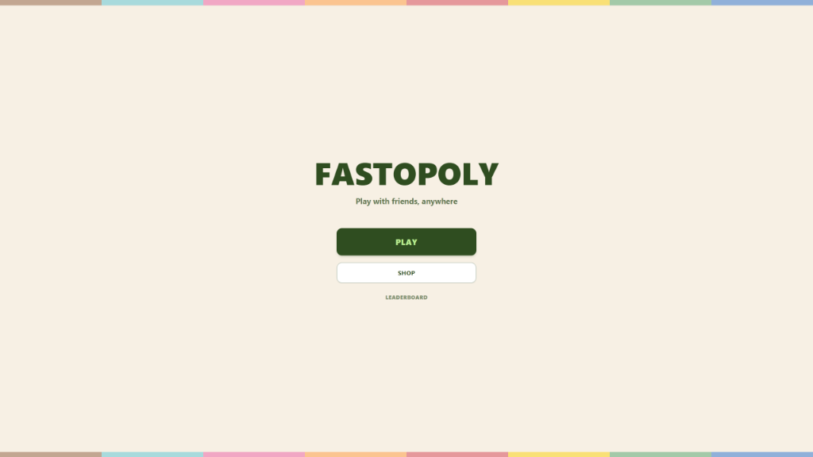
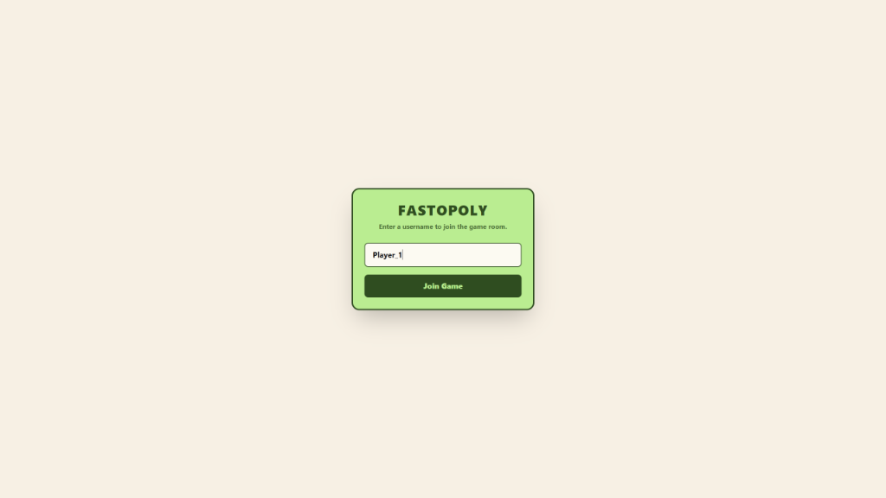
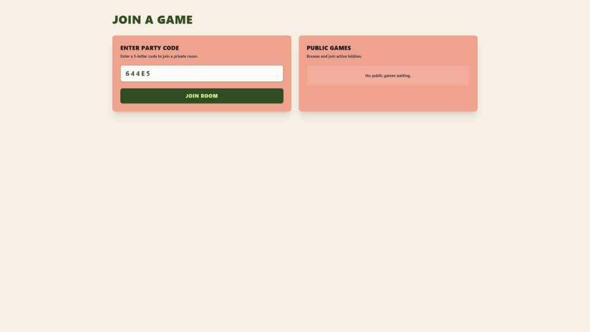
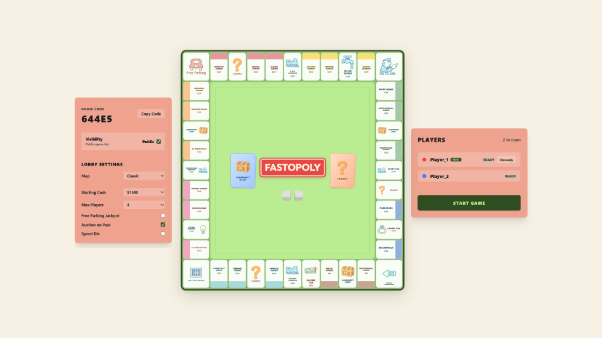
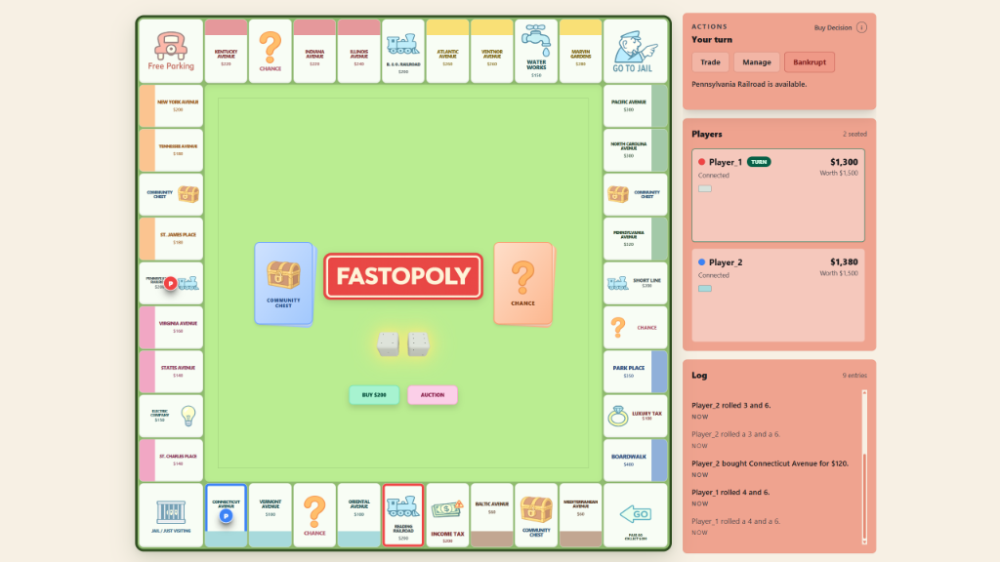

# Fastopoly 🎲

Fastopoly is a modern, real-time multiplayer Monopoly clone web application. It features a stunning responsive 3D board, interactive 3D dice rolling, and persistent multiplayer sync.

Built with **Next.js**, **TypeScript**, **Liveblocks**, and **Supabase**.

---

## 🚀 Features

- **Real-Time Multiplayer**: Built on Liveblocks Room and Presence APIs to synchronize board state, turn status, player movements, and interactions with millisecond latency.
- **Interactive 3D Gameboard**: A beautifully styled responsive Board layout featuring all standard Monopoly spaces, color groups, and animations.
- **3D Physics Dice Roller**: Fully-rendered 3D dice with randomized spins and smooth snapping transitions. Roll outcomes are persistent and synchronized globally.
- **Robust Player Reconnection**: Automatic fallback mechanisms matching players by connection ID or active presence username to keep games going if a player refreshes or disconnects.
- **Property & Finance Management**:
  - Buying unowned properties, railroads, and utilities.
  - Interactive Property Manager to build houses, hotels, mortgage/unmortgage properties, or declare bankruptcy.
  - Automatic rent computation based on housing counts, color groups, and dice roll values.
- **Player Trades**: Open a trade window with any active connected opponent to exchange cash and properties securely.
- **Custom Game Rules**: Configure custom rule sets when creating a room (starting cash, free parking pool/jackpot, auction rules, speed die, etc.).
- **Live Leaderboard & History**: Automatically persists completed game stats and placements to Supabase.

---

## 🔄 Room Lifecycle & System Workflow

Fastopoly features an automated, real-time lifecycle that manages game sessions from initial hosting to active gameplay. The process is synchronized using Supabase for persistence and Liveblocks for low-latency state updates.

### 1. Room Creation (Instant Hosting)
- **Landing Page**: Hosts land on the home screen and click **PLAY**. If they don't have a username, the green username modal prompts them to enter one.
- **Instant Hosting**: Clicking **Host a game** triggers a request to `/api/lobby/create`.
- **Database Entry**: This endpoint inserts a new room row in the Supabase `public_rooms` table with a status of `'waiting'`.
- **Redirect**: The client is immediately redirected to `/game/${roomId}` (where `roomId` is a unique 5-character code).

| Landing Page | Username Modal |
| :---: | :---: |
|  |  |

---

### 2. Joining a Room
- **Join Interface**: Players can join via `/lobby/join` by inputting a 5-letter room code or browsing currently active lobbies in the **PUBLIC GAMES** list.
- **Supabase Query**: The public games panel queries Supabase for rooms whose status is `'waiting'` and are marked public.



---

### 3. Lobby Waiting Phase
- **Presence Sync**: Joined players are immediately connected to the Liveblocks room. Their status (color, token, username, and "Ready" state) is synchronized in real-time.
- **Merged Settings (Left Panel)**: The lobby host can toggle the room's public status, select the map (Classic, Mega, etc.), and adjust rules (Starting Cash, Max Players, Free Parking Jackpot, Auction rules, and Speed Die).
- **Players Panel (Right Panel)**: Displays current players, their ready toggles, and host designation.
- **Start Game Trigger**: The **Start Game** button is only enabled when all players are marked "READY".



---

### 4. Transitioning to Active Gameplay
- **Game Initialization**: When the host clicks **Start Game**, it calls the `/api/game/init` endpoint.
- **State Transition**:
  - Sets the storage's `gamePhase` to `'playing'`.
  - Populates player status, sets starting cash, and distributes starting properties.
  - Updates the Supabase room status to `'playing'` (removing it from the public rooms browser).
- **Layout Transition**:
  - The left settings panel smoothly transitions its width and opacity to zero and slides out of view.
  - The board column automatically scales and centers in the viewport.
  - The right-side control cards (Actions, Players, Log) lock scroll position and stack vertically to provide a fixed dashboard.



---

## 🛠️ Technology Stack

- **Framework**: [Next.js (App Router)](https://nextjs.org/)
- **Programming Language**: [TypeScript](https://www.typescript.org/)
- **Real-time Sync**: [Liveblocks](https://liveblocks.io/)
- **Database / Backend**: [Supabase](https://supabase.com/)
- **Styling**: [Tailwind CSS](https://tailwindcss.com/) & Vanilla CSS

---

## 📦 Getting Started

### 1. Prerequisites

Make sure you have Node.js installed (v18+ recommended) and a package manager like npm, yarn, or pnpm.

### 2. Install Dependencies

Clone this repository and run:

```bash
npm install
```

### 3. Environment Configuration

Create a `.env.local` file in the root directory and configure the following environment keys:

```ini
# Liveblocks API Keys (for real-time synchronization)
LIVEBLOCKS_SECRET_KEY=your_liveblocks_secret_key

# Supabase Configurations (for persisting game results and users)
NEXT_PUBLIC_SUPABASE_URL=your_supabase_url
NEXT_PUBLIC_SUPABASE_ANON_KEY=your_supabase_anon_key
SUPABASE_SERVICE_ROLE_KEY=your_supabase_service_role_key
```

### 4. Running the Development Server

Start the local server by running:

```bash
npm run dev
```

Open [http://localhost:3000](http://localhost:3000) in your browser.

---

## 📂 Project Structure

```text
├── app/                  # Next.js pages & API routes
│   ├── api/              # Game engine state mutations & authorization routes
│   ├── game/             # Interactive gameplay screen pages
│   ├── lobby/            # Create and join game rooms
│   └── page.tsx          # Main entrypoint landing page
├── components/           # Reusable UI & Game Board components
│   ├── game/             # DiceRoller, TradePanel, PropertyManager, Tile, etc.
│   └── lobby/            # Room settings and player lists
├── hooks/                # Custom React Hooks (sync, connection status)
├── lib/                  # Shared game engines, rules, board maps, and config
│   ├── game-engine/      # Board definitions, rules, scoring, and server state mutating logic
│   └── liveblocks.config.ts  # Liveblocks client context & state schemas
└── public/               # Static assets (images, logos, textures)
```

---

## 📄 License

This project is open-source software licensed under the [MIT License](LICENSE).
